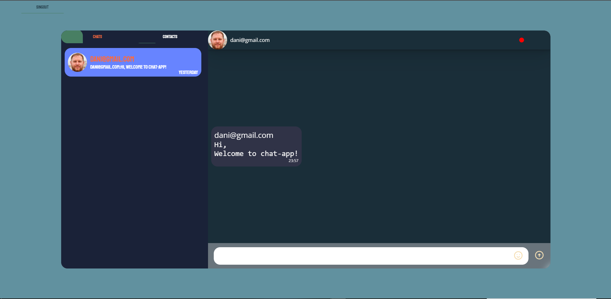
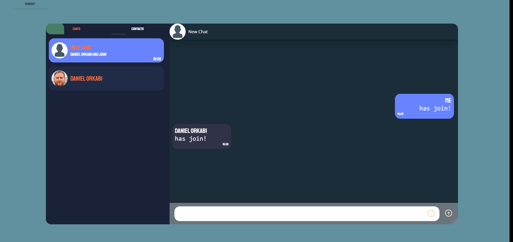
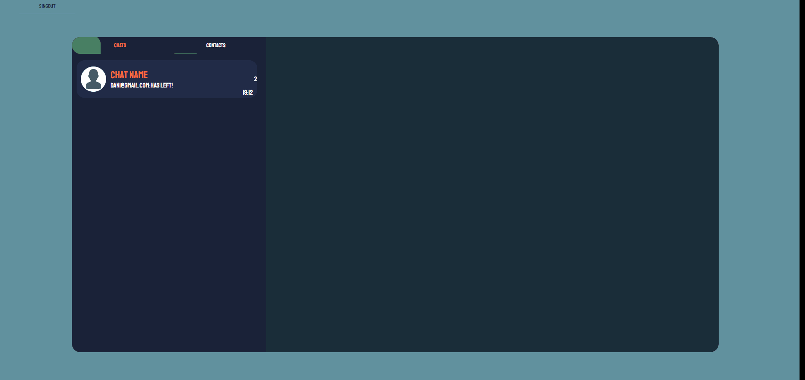

<div id="top" align="center">
  
  <h1>Chat App Web</h1>
</div>

## Introduction

Chat-App is web project that I made when learning web development. It's inspired by WhatsApp and Messenger: in the app you can send messeges in realtime to users by private rooms or even group rooms.

When you talk in private room with someone he can recive your message from any user.

You can talk in group rooms with other users by adding them and you van remove them from the group.

## Technologies used

- [`React`](https://reactjs.org/) as the view layer of the app;
- [`Redux`](https://redux.js.org/) for managing the app's state;
- [`NodeJs and Express`](https://nodejs.dev/) as the main backend of the app;
- [`MongoDB`](https://www.mongodb.com/) as the databse fot the app;
- [`RxJs`](https://rxjs.dev/) for compose asynchronous or callback-based code;

... and some [more stuff](./client/package.json).

## Running locally

### Setting up the project

Clone the repository,int the VS Code open 2 terminals and run the following:

```console
cd client
$ npm install
```

```console
cd server
$ npm install
```

### Running the app 

Running the following will start the server and the client and will automatically open the webapp in your
default browser:

in the server terminal :

```console
$ npm start
```

in the client terminal :

```console
$ npm start
```
### Features

#### Example Chat


#### Add Contact


#### Create Private Chat


#### Create Group Chat


#### Leave Group Chat


#### Add To Group Chat



### Contact
Daniel Orkabi - [linkedin.com/in/danielorkabi](linkedin.com/in/danielorkabie)
- danielorkabi@gmail.com


<p align="right">(<a href="#top">back to top</a>)</p>

